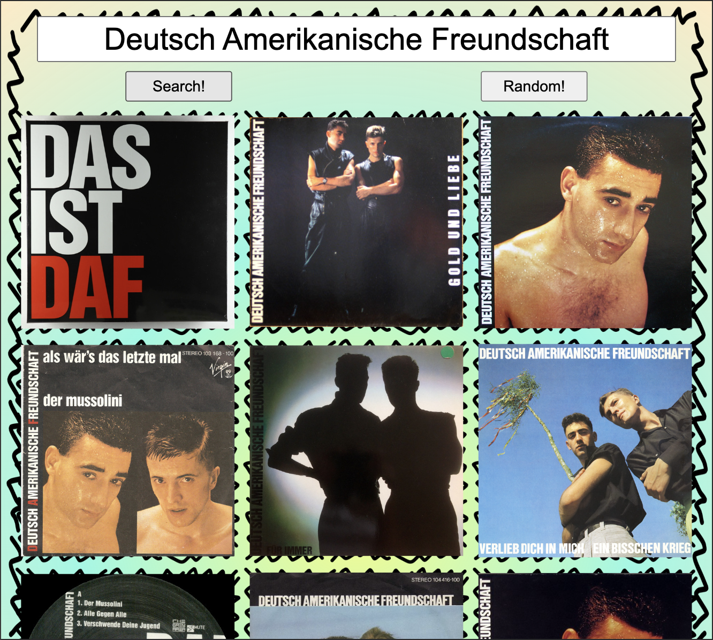

<h1 style="text-align: center;"> -- reSearch Music with Images -- </h1>

A simple program that interacts with the discogs.com database. Search for music without alogrithims(sort of)

 'Search!': Enter a search term, hit enter or search and reSearch will give you 10 images from Discogs'search. Click on an image that interests you and there are three links.   The first link ('discogs link') will take you to the artist, label, or release on Discogs.com.   The second button ('reSearch') will take the title or artist name from your selection and 'reSearch' the term.  The third link will take the title or name and search it on youtube.com. This can not give the intended result sometimes but that could be fun!
 

